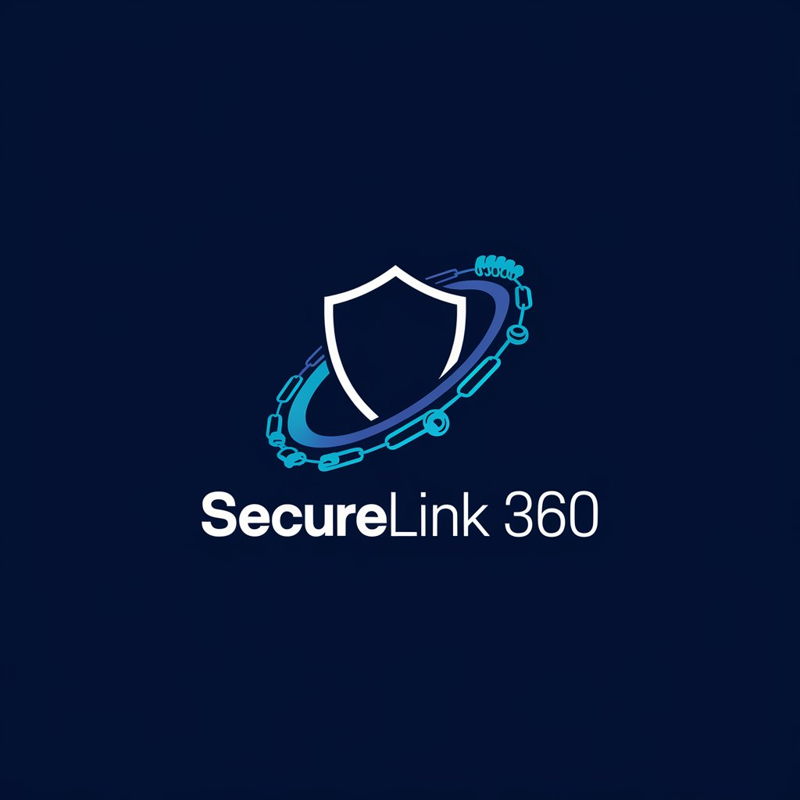

# SecureLink 360 - Multi-Tenant Network Scanning as a Service



## Project Overview

**SecureLink 360** is a **Network Scanning as a Service** platform designed to help companies protect their networks by detecting unauthorized devices. It allows **company admins and employees** to monitor network activity, view connected devices, and receive real-time alerts when intruders are detected.

The platform supports **multi-tenant SaaS**, giving each company its own workspace, license, and user management, while enforcing data isolation and seat-based licensing.

The interface includes **light/dark modes** and a responsive sidebar for seamless navigation across devices.

---

## ✅ Key Features

* **🛡 Multi-Tenant Support**: Each company has a private workspace with isolated data.
* **👥 Role-Based Access Control (RBAC)**: Admins manage employees and control access to sensitive features.
* **📜 License Management**: Automatic enforcement of license expiry and seat limits.
* **✉ Employee Onboarding**: Admins can invite staff via secure activation links.
* **📡 Real-Time Network Monitoring**: Intruder detection with email and push notifications.
* **📊 Company Dashboards**: Company-specific views for devices, alerts, and license status.
* **🌗 Light/Dark Mode Toggle**: Seamless switching between themes.
* **📱 Responsive Design**: Optimized sidebar and layout for mobile, tablet, and desktop.

---

## ⚙ Installation

### Requirements

* Python 3.x
* Django 3.x+
* Bootstrap 5.x
* JavaScript
* Database: SQLite (development), MySQL/PostgreSQL (production)

### Steps to Install Locally

```bash
# Clone the repository
git clone https://github.com/oladokedamilola/securelink360.git
cd securelink360

# Set up a virtual environment
python -m venv venv
source venv/bin/activate  # Windows: venv\Scripts\activate

# Install dependencies
pip install -r requirements.txt

# Set up the database
python manage.py migrate

# Create a superuser
python manage.py createsuperuser

# Run the development server
python manage.py runserver
```

Access the platform at `http://127.0.0.1:8000/`.

---

## 🖥 Usage

* **Admin Dashboard**: Manage companies, licenses, and employees.
* **Employee Dashboard**: View devices, alerts, and company-specific data.
* **Theme Toggle**: Switch between light/dark modes via the navbar button.
* **License Enforcement**: Blocks expired licenses and enforces seat limits.
* **Employee Onboarding**: Accept invitations via secure email links.

---

## 🛠 Technologies Used

* **Backend**: Django (Python)
* **Frontend**: HTML, CSS (Bootstrap 5), JavaScript
* **Database**: SQLite (dev), MySQL/PostgreSQL (prod)
* **Network Scanning**: Python Nmap, Scapy
* **Real-Time Notifications**: Email, browser push notifications
* **Payments**: Stripe/PayPal for licensing and subscriptions

---

## 📄 License

MIT License

---